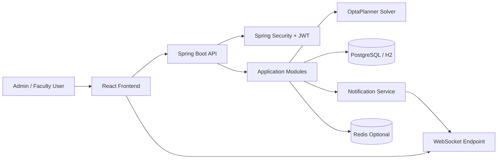
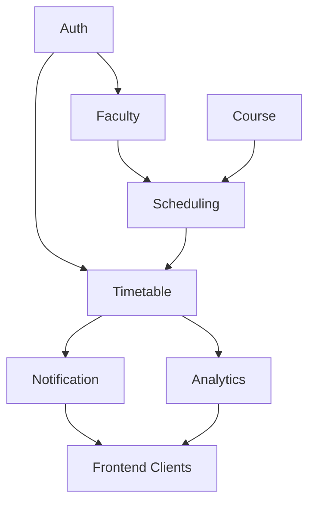
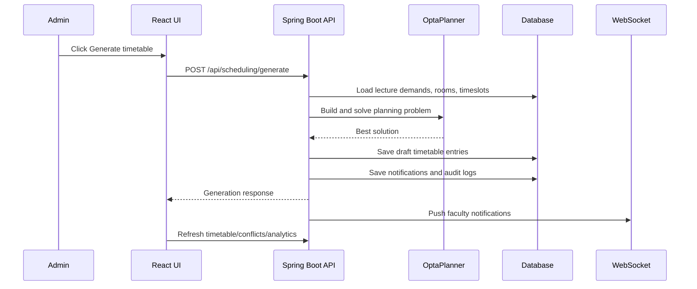
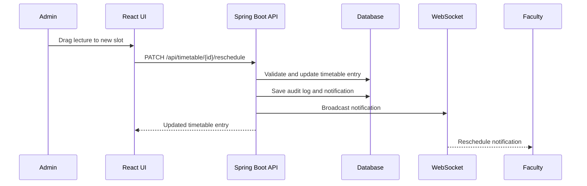

# OpenSchedulr Architecture

## High-level architecture

OpenSchedulr uses a modular monolith to keep hosting cost at zero or near zero while still separating business concerns cleanly.

## System diagram

Modules:

- Auth
- Faculty
- Course
- Scheduling
- Timetable
- Notification
- Analytics

## Data flow

### 1. Input flow

- Faculty availability and preferences are stored
- Courses define required teaching demand
- Rooms define capacity and type
- Timeslots define the scheduling grid
- Lecture demands define course-to-faculty assignment counts

### 2. Solver flow

- `LectureDemand` records are expanded into `LectureAssignment` planning entities
- Rooms and timeslots are treated as planning value ranges
- OptaPlanner solves using hard and soft constraints

## Module diagram

Hard constraints:

- No faculty overlap
- No room overlap
- Room type compatibility

Soft constraints:

- Balanced workload
- Earlier slot preference

### 3. Persistence flow

- Solver output becomes `TimetableEntry` rows
- Entries are stored as draft schedule data
- Manual overrides update the same model with source tracking

### 4. Realtime flow

- Schedule changes create notifications
- Notifications are stored in the database
- WebSockets broadcast updates to subscribed users

### 5. Analytics flow

- Timetable entries are aggregated by faculty and room
- Conflict scans produce warning lists
- Frontend renders summary cards and panels

## Request flow example: generate schedule

1. Frontend sends `POST /api/scheduling/generate`
2. Backend authenticates the request
3. Scheduling service loads lecture demands, rooms, and timeslots
4. OptaPlanner computes a best-fit draft schedule
5. Backend persists timetable entries
6. Backend creates notifications and audit logs
7. Frontend refreshes timetable and analytics

### Sequence diagram: generate schedule

## Request flow example: reschedule entry

1. Frontend sends `PATCH /api/timetable/{entryId}/reschedule`
2. Backend validates entry, room, and timeslot
3. Backend updates the timetable entry
4. Entry source changes to manual
5. Backend emits a notification event

### Sequence diagram: manual override

