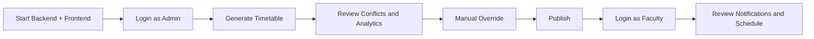

# OpenSchedulr Tutorial

This tutorial walks through the complete local experience from startup to published timetable.

## Tutorial map

## Tutorial 1: First local run

1. Clone the repository
2. Start the backend
3. Start the frontend
4. Open `http://localhost:5173`
5. Log in with the admin account

Expected result:

- You reach the dashboard
- Seed data is already available
- The system is ready for timetable generation

## Tutorial 2: Generate a schedule

1. Log in as `admin@openschedulr.dev`
2. Click `Generate timetable`
3. Wait for dashboard refresh
4. Review timetable cards and conflict detector

Expected result:

- Draft timetable entries are created
- Faculty and room assignments are produced
- Notifications are generated

## Tutorial 3: Manual override

1. Stay logged in as admin
2. Drag a lecture card to another timeslot
3. Drop the card in the new slot

Expected result:

- The timetable entry is rescheduled
- The entry source becomes manual
- A notification is sent to the affected faculty member

## Tutorial 4: Publish the timetable

1. Review conflicts and analytics
2. Click `Publish`

Expected result:

- Draft entries become published entries
- The schedule becomes the official timetable

## Tutorial 5: Faculty view

1. Log out
2. Log in with a faculty account
3. Review notifications and timetable data

Expected result:

- Faculty can see updates and personal schedule information
