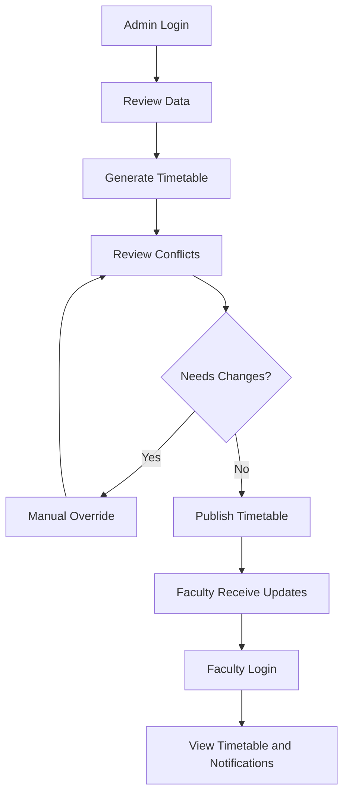
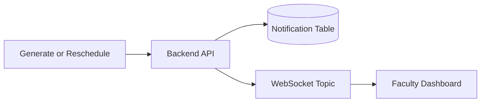

# OpenSchedulr User Flow

## User journey diagram

## Admin flow

1. Admin logs in
2. Admin reviews faculty, course, room, and timeslot data
3. Admin triggers automatic schedule generation
4. Admin reviews conflicts and analytics
5. Admin manually adjusts timetable entries if needed
6. Admin publishes the timetable
7. Faculty receive notification updates

## Faculty flow

1. Faculty logs in
2. Faculty opens the dashboard
3. Faculty reviews timetable and notifications
4. Faculty receives real-time updates after changes

## Manual override flow

1. Admin drags a lecture card to a new slot
2. Frontend calls the reschedule API
3. Backend validates and saves the update
4. Audit and notification records are created
5. UI refreshes the updated timetable

## Notification flow diagram

